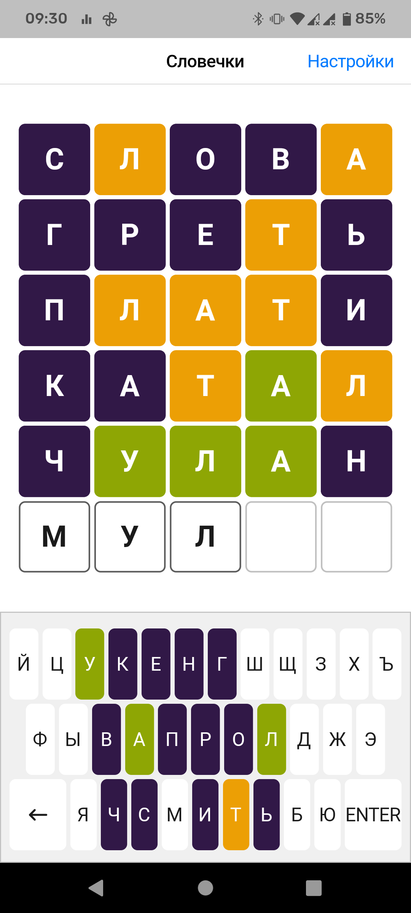
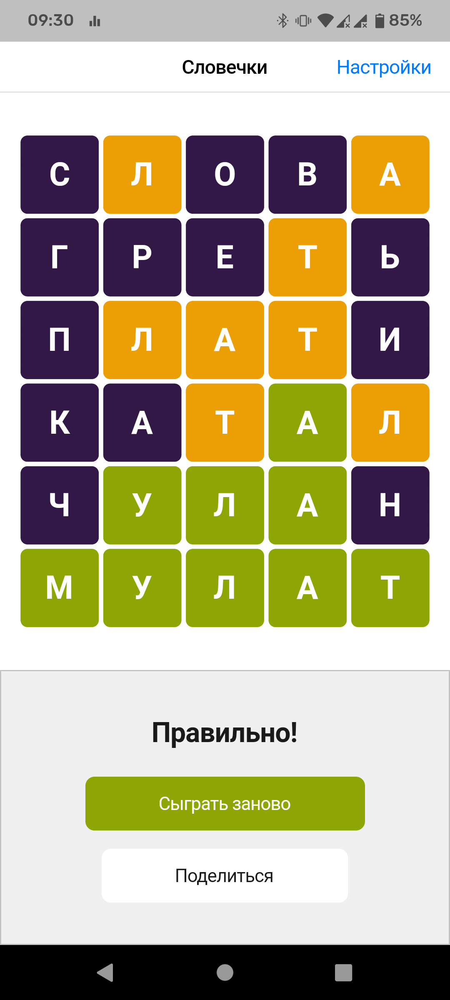
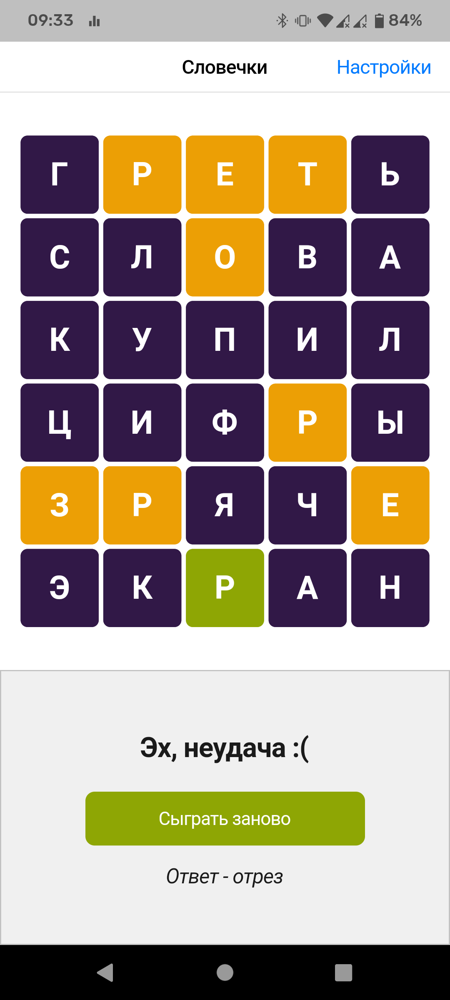

# Russian Wordle

A Wordle clone app prototype build with Flutter.

## Features:

- Russian dictionaries for guessing and checking words.
- Win/Lose screen.
- Animations and tactile feedback.

## Screenshots:

